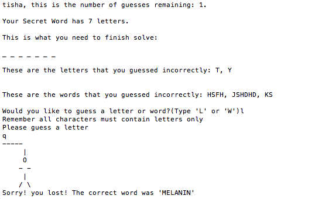
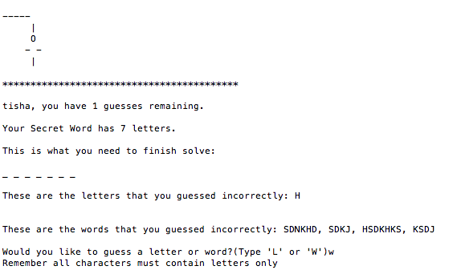
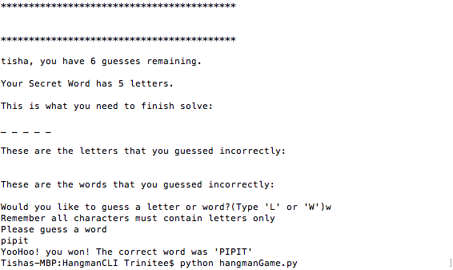

# HangmanCLI
This repo contains 2 command line versions of the popular game Hangman- one built in Python, the other built with NodeJS(in development). 

Initially, I wanted to create a Web Application that would allow me to utilize JavaScript/Nodejs, Databases, and Sockets. I however experienced some issues with working with the asynchronous nature of node, with respect to ensuring the receipt of data before moving on to the next step of the game loop. Unfortunately I experienced set backs in the Nodejs Command Line App as well because of the work arounds I had to implement for use input the command line. These setbacks prevented the necessary testing of the functions created so that I can move from from step to the next.

In the interest of time with respect to the deadline of the project, I switched to working on this Python Command Line Application, with hopes of debugging and completing the other 2 Nodejs apps at a later time.


### Web App version
An web app game is currently in development, and can be forked or cloned from [github](https://github.com/tgreenidge/Hangman) or played [online](https://hangman-extreme.herokuapp.com/).


# The instructions below are for getting started on the PYTHON Command Line Game
- Install python
- Clone project or fork from this repository
- Navigate to project root folder (HangmanCLI/) in the command line
- Enter the following in the command line:
  ``` python hangmanGame.py ```


## Instructions to create  a different list of words that is found in the dictionaryWords.js file
- Install [nodejs](https://nodejs.org/en/)
- Install [npm](http://blog.npmjs.org/post/85484771375/how-to-install-npm)
- Install game dependencies

- In the root folder of the Hangman project in the command line, type:

 ```npm install```

   
- Manipulate the parameters for the API to select your preferences
 
  - API: http://linkedin-reach.hagbpyjegb.us-west-2.elasticbeanstalk.com/words
 
  - Parameters: See document online for parameters to be passed into string query

- From the root folder of the project, type the following in the command line:

``` node createDictionary.js ```

- This will replace the file called **dictionaryWords.json** in the **dictionary** folder 


# Game Play

## Game Rules
- The player plays against the computer 
- The computer choses a word
- If the player does not guess correctly under 6 tries, the computer wins
- On each try, player can guess either a letter or a word
- On each try, if the answer is incorrect, an actual hangman diagram is displayed as it gets filled
 

### Guesses
If player tries to solve the answer by guessing the word:
  - If the word is correct, the player wins the game
  - If the word is incorrect, no letters are revealed in the answer
  - Incorrect word guesses are displayed

If player tries to solve the answer by guessing one letter at a time:
  - Correct letters in the answer are revealed in their correct positions
  - Incorrect letter guesses are displayed

### Dictionary Words and difficulty 
- The words are of 4 to 8 letters only, and of difficulty levels 1 & 2 based on the API standards


# Current Game Work Flow

  Create new player
  
          \/
  
  Create new game
  
          \/
  
  Start new game
  
  
  *** GAME PLAY ****
  
  Access dictionary to obtain random, secret word, and display word length to user as blanks
  
          \/

  *** Loop Below until win or lose ***
  
  Display Current Game Statistics to the User
  
          \/
  
  Prompt user to declare expected input type (letter or word)
  
          \/
  
  Validate user input 
  
          \/
  
  Prompt user for input 
  
          \/
  
  Validate User input (input should match the declared input type)
   
          \/
  
  Process Input to determine win or loss
   
          \/
  
  Game Ends when there was a win/loss


  *** Design ***
  
  Object Oriented programming was used, where a game has only one player

  *** TESTING ***
  
  No formal testing framework was used, but tests were carried out for different input situations,
  at each stage of the game development to ensure currect output was expect. Tests conducted included:
  
  - Correct progression of hangman display the game progressed through the loop
  - 'L' for letter, 'W' for word is entered to declare input type
  - Input that are not all letter characters are rejected
  - Words had more than one character; letters have only one character
  - All methods when called produced satisfatory output
  - Combinations of letters/words were used and produced correct output

# Example Output

**Example 1**




**Example 2**




**Example 3**




# Techology Stack
- Python -  Game play
- Node.js - To create JSON file from API
- Github 


Waffle.io was also used as a project management tool to keep track of requirements, bugs, and other issues

# Future plans for version 2.0

- Create data structure to store registered users (and winning information)
- Create Leader Board that ranks players based on number of their winning games. Ties would be resolved by ranking players who reached the respective number of games won at an earlier date higher than others. This version of the game prepares for this by capturing player's total number of games won and time of winning at the end of a winning game


# To run/ contibute to the Nodejs Command Line App

Once node and npm are installed. In the root folder, 

- Download dependencies

 ```npm install```

- Start the node server from the root folder:
  
  ```node hangmanGame```

